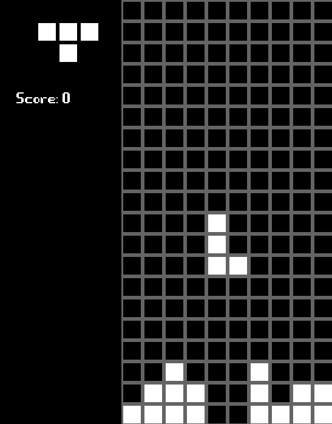

<h1>Tetris</h1>  
<h4>Installation:</h4>
use make to compile 
./tetris 
(only works if you are inside the same folder as the game)

<h4>Controls:</h4>
left/right arrows to move piece 
up arrow to rotate piece

<h4>Dependences:</h4>
allegro
  

